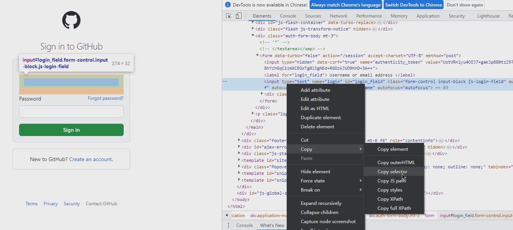
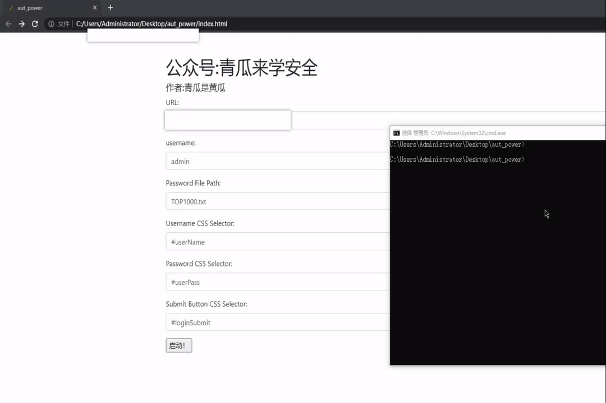
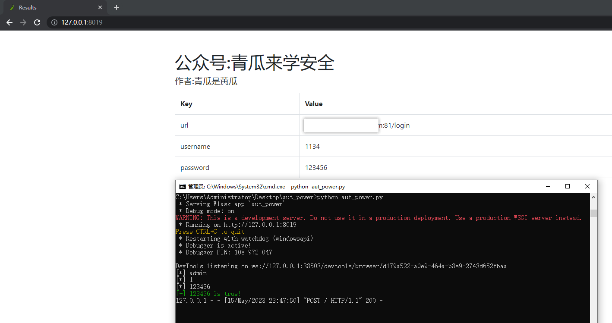

# aut_power
<h1 align="center">
  <br>
  
</h1>

<h4 align="center">aut_power 基于python的自动化模拟登录</h4>

<p align="center">
  <a href="#开始">开始</a> •
  <a href="#调整">调整</a> •
  <a href="#示例">示例</a> •
  <a href="#faq">FAQ</a> •
</p>

[简体中文]

---

## 开始

**安装库**
- 建议先给pip换源 [[Recommend](https://webxxe.cn/index.php/archives/452/)]
  - [(https://webxxe.cn/index.php/archives/452/)](https://webxxe.cn/index.php/archives/452/)

- pip install
  - `pip install -r requirements.txt`

> 电脑要自己下有chrome浏览器，项目中的版本是113.0版本的
> 
> 如果显示"This version of ChromeDriver only supports Chrome version 11x"错误请到[(https://chromedriver.chromium.org/downloads)](https://chromedriver.chromium.org/downloads)下载自己chrome浏览器对应的chromedriver.exe版本，再替换掉项目中的chromedriver.exe

**使用**

1.启动
```bash
python aut_power.py
```

2.双击打开index.html，填写好对应信息
- URL : `登陆页面地址`
- username : `登陆用户名`
- Password File Path : `密码字典路径`
- Username CSS Selector : `登陆页面填入账号的标签的selector`
- Password CSS Selector : `登陆页面填入密码的标签的selector`
- Submit Button CSS Selector : `登陆页面点击提交的标签的selector`

复制selector方法如下：


**python环境**

适配python3.7以上环境


**适用环境**

适用于账号密码经过加密处理，登陆后没有跳转，没有弹窗，没有验证码,不设错误次数的登陆页面


---

## 调整

因为登陆的速度和网速成正比，所以在使用的时候如果网速慢或者挂了全局代理，可以自行到aut_power.py中调整等待时间稍长一点

可调节处已经标注`#等待结果`

## 示例



## FAQ

**我运行后很多爆红怎么回事**

- 网速慢，爆破快，等待时间短，可以自行更改aut_power.py中的等待时间

**我想固定密码只爆账号怎么办**

- 你可以在username栏填写固定的密码，然后把Username CSS Selector栏和Password CSS Selector栏的selector内容调换一下就好了

---
> create by Grimm-745
